# Module 14 — Calculator App

A FastAPI-based calculator application with PostgreSQL persistence, JWT authentication, Docker containerization, and a full CI/CD pipeline. This module builds on previous work by adding secure user registration/login, front-end pages, Playwright E2E tests, and production-ready deployment.

---

## Table of Contents

1. [What Was Built](#what-was-built)
2. [Project Structure Changes](#project-structure-changes)
3. [How to Run Locally](#how-to-run-locally)
4. [Running the Front-End Pages](#running-the-front-end-pages)
5. [Running the Tests](#running-the-tests)
6. [API Endpoints](#api-endpoints)
7. [How the Calculation Model Works](#how-the-calculation-model-works)
8. [How the Pydantic Schemas Work](#how-the-pydantic-schemas-work)
9. [Factory Pattern Explained](#factory-pattern-explained)
10. [JWT Authentication](#jwt-authentication)
11. [CI/CD Pipeline](#cicd-pipeline)
12. [Docker Hub](#docker-hub)
13. [Output Screenshots](#output-screenshots)

---

## What Was Built

* FastAPI backend with REST APIs
* PostgreSQL database using SQLAlchemy
* JWT authentication (login/register)
* Front-end UI (HTML + JavaScript)
* Playwright E2E testing
* Unit & integration testing with pytest
* Docker containerization
* CI/CD pipeline with GitHub Actions

---

## Project Structure Changes

```
module14-calculator-app/
│
├── .github/
│   └── workflows/
│       └── test.yml                  # GitHub Actions CI pipeline
│
├── .vscode/
│   └── settings.json                 # VS Code workspace settings
│
├── app/                              # Core application package
│   ├── __init__.py
│   ├── main.py                       # FastAPI app, all routes & endpoints
│   ├── database.py                   # SQLAlchemy engine & session setup
│   ├── database_init.py              # DB initialization helper
│   │
│   ├── auth/                         # Authentication module
│   │   ├── __init__.py
│   │   ├── dependencies.py           # Auth dependency injection (get_current_user)
│   │   ├── jwt.py                    # JWT token creation & verification
│   │   └── redis.py                  # Redis client for token blocklist
│   │
│   ├── core/                         # App configuration
│   │   ├── __init__.py
│   │   └── config.py                 # Pydantic settings (env vars, JWT config)
│   │
│   ├── models/                       # SQLAlchemy ORM models
│   │   ├── __init__.py
│   │   ├── calculation.py            # Calculation model & DB table
│   │   └── user.py                   # User model & DB table
│   │
│   ├── operations/                   # Calculator logic
│   │   └── __init__.py               # Math operations (add, subtract, etc.)
│   │
│   └── schemas/                      # Pydantic request/response schemas
│       ├── __init__.py
│       ├── base.py                   # Shared base schema
│       ├── calculation.py            # Calculation create/read/update schemas
│       ├── token.py                  # JWT token schemas
│       └── user.py                   # User create/read schemas
│
├── static/                           # Static assets
│   ├── css/
│   │   └── style.css                 # Application styles
│   └── js/
│       └── script.js                 # Frontend JavaScript
│
├── templates/                        # Jinja2 HTML templates
│   ├── layout.html                   # Base layout with nav/head
│   ├── index.html                    # Landing / home page
│   ├── login.html                    # Login form
│   ├── register.html                 # User registration form
│   ├── dashboard.html                # User dashboard (list calculations)
│   ├── view_calculation.html         # View single calculation detail
│   └── edit_calculation.html         # Edit existing calculation
│
├── tests/                            # Test suite
│   ├── __init__.py
│   ├── conftest.py                   # Shared fixtures (DB, client, auth)
│   │
│   ├── unit/                         # Unit tests
│   │   ├── __init__.py
│   │   └── test_calculator.py        # Tests for math operations
│   │
│   ├── integration/                  # Integration tests
│   │   ├── __init__.py
│   │   ├── test_calculation.py       # Calculation CRUD API tests
│   │   ├── test_calculation_schema.py# Schema validation tests
│   │   ├── test_database.py          # DB connection & model tests
│   │   ├── test_dependencies.py      # Auth dependency tests
│   │   ├── test_schema_base.py       # Base schema tests
│   │   ├── test_user.py              # User API tests
│   │   └── test_user_auth.py         # Auth flow tests (login, logout, refresh)
│   │
│   └── e2e/                          # End-to-end tests (Playwright)
│       ├── __init__.py
│       ├── test_e2e.bk               # Backup / draft E2E tests
│       └── test_fastapi_calculator.py# Full browser E2E test suite
│
├── .gitignore
├── Dockerfile                        # App container definition
├── LICENSE                           # MIT License
├── README.md
├── docker-compose.yml                # Multi-service orchestration (app + db + pgadmin)
├── init-db.sh                        # PostgreSQL init script (creates test DB)
├── pytest.ini                        # Pytest configuration & coverage settings
└── requirements.txt                  # All Python dependencies
```

---

## How to Run Locally

```bash
python -m venv venv
source venv/bin/activate   # Mac/Linux
venv\Scripts\activate      # Windows

pip install -r requirements.txt

uvicorn app.main:app --reload
```

App URL:

```
http://localhost:8000
```

---

## Running the Front-End Pages

Open in browser:

```
http://localhost:8000
```

Features:

* User registration
* Login
* Calculator operations

---

## Running the Tests

### Unit Tests

```bash
pytest tests/unit
```

### Integration Tests

```bash
pytest tests/integration
```

### E2E Tests

```bash
pytest tests/e2e
```

---

## API Endpoints
| Method | Endpoint | Description |
|---|---|---|
| `POST` | `/auth/register` | Register a new user |
| `POST` | `/auth/login` | Login and get JWT tokens |
| `POST` | `/auth/logout` | Logout (invalidate token) |
| `POST` | `/auth/refresh` | Refresh access token |
| `GET` | `/calculations` | List all calculations |
| `POST` | `/calculations` | Create a new calculation |
| `GET` | `/calculations/{id}` | Get a single calculation |
| `PUT` | `/calculations/{id}` | Update a calculation |
| `DELETE` | `/calculations/{id}` | Delete a calculation |
 
Full interactive docs available at `/docs` (Swagger UI) when the app is running.
---

## How the Calculation Model Works

* Built using SQLAlchemy ORM
* Fields include:

  * id
  * a, b
  * type
  * result
* Supports polymorphic operations (add, subtract, multiply, divide)

---

## How the Pydantic Schemas Work

* Validate request data
* Enforce type safety
* Separate input/output schemas

Example:

```python
class CalculationCreate(BaseModel):
    a: float
    b: float
    type: str
```

---

## Factory Pattern Explained

* Dynamically selects operation type
* Avoids large conditional statements

Example:

```python
def calculation_factory(type):
    if type == "add":
        return AddOperation()
```

---

## JWT Authentication

* Secure login using JWT tokens
* Password hashing with bcrypt
* Tokens stored client-side
* Protected endpoints require authentication

---

## CI/CD Pipeline

* GitHub Actions automates:

  * Dependency installation
  * Running tests
  * Build validation

Example:

```yaml
on:
  push:
    branches: [main]
```

---

## Docker Hub

### Build Image

```bash
docker build -t calculator-app .
```

### Run Container

```bash
docker run -p 8000:8000 calculator-app
```

---

## Output Screenshots

*Add screenshots here:*

* Home page
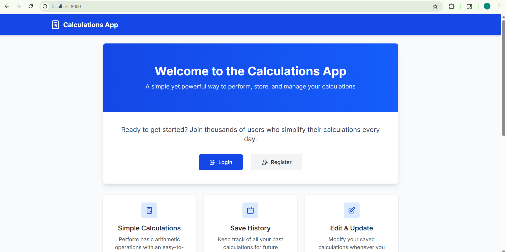
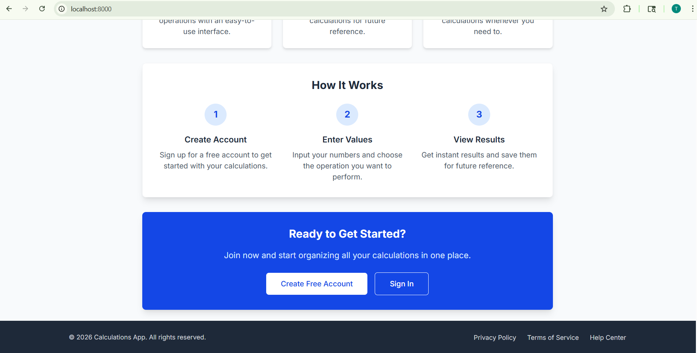
* Register and Login page
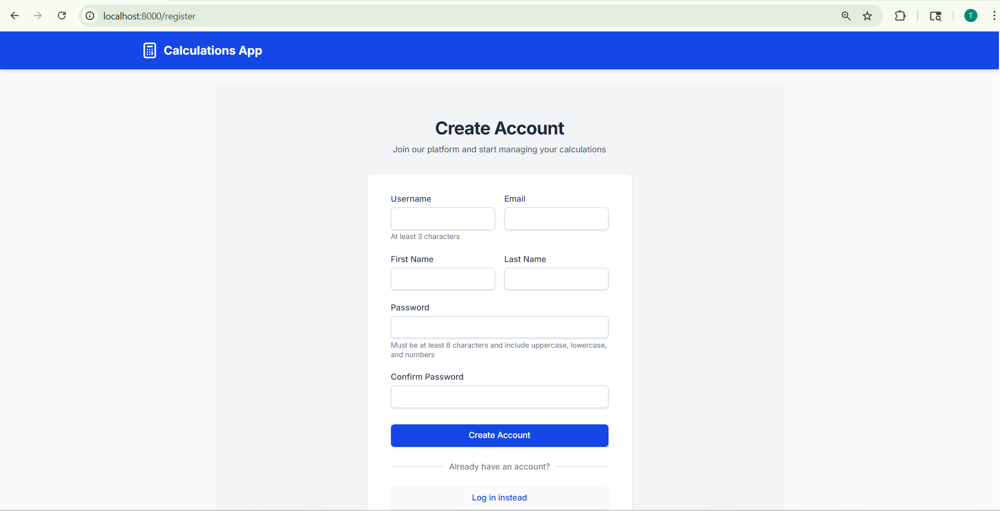
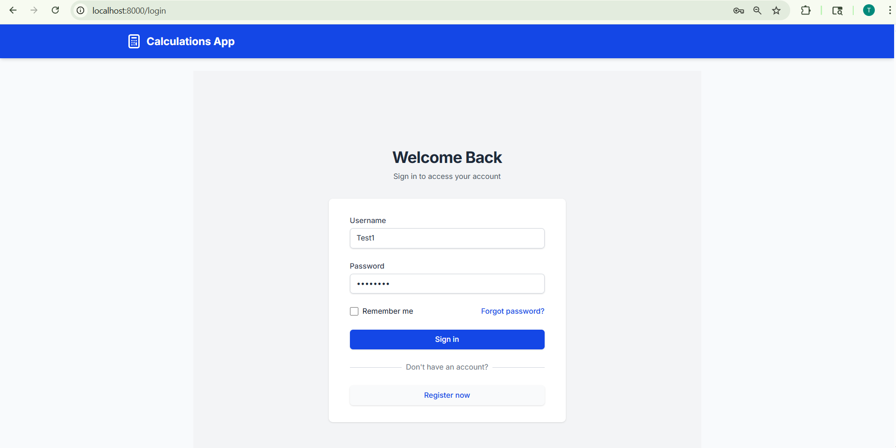
* Calculator UI
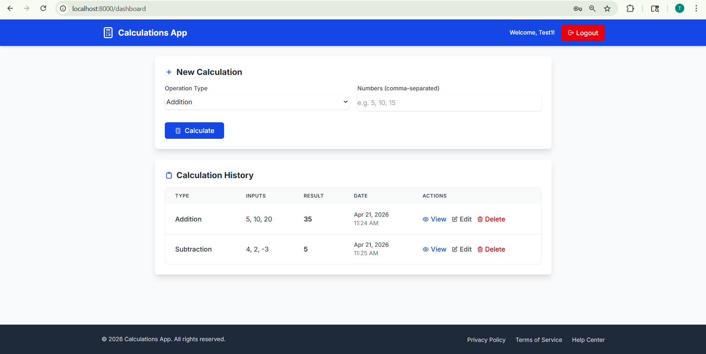
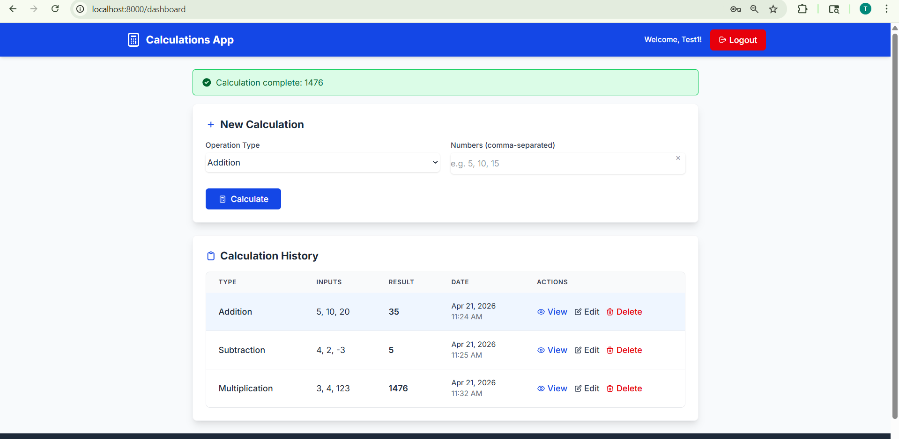
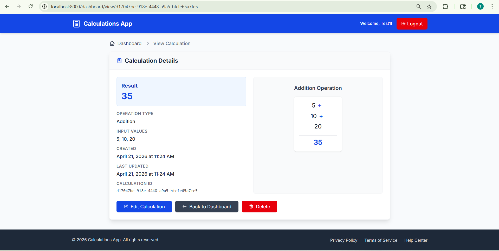
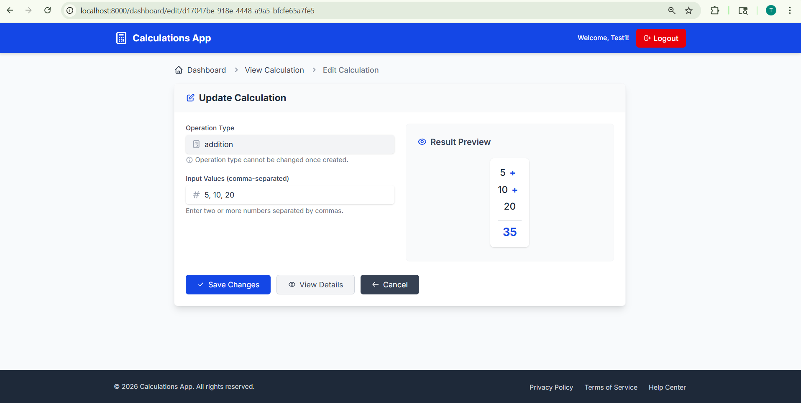
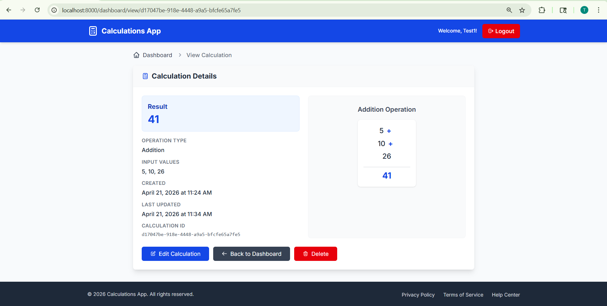

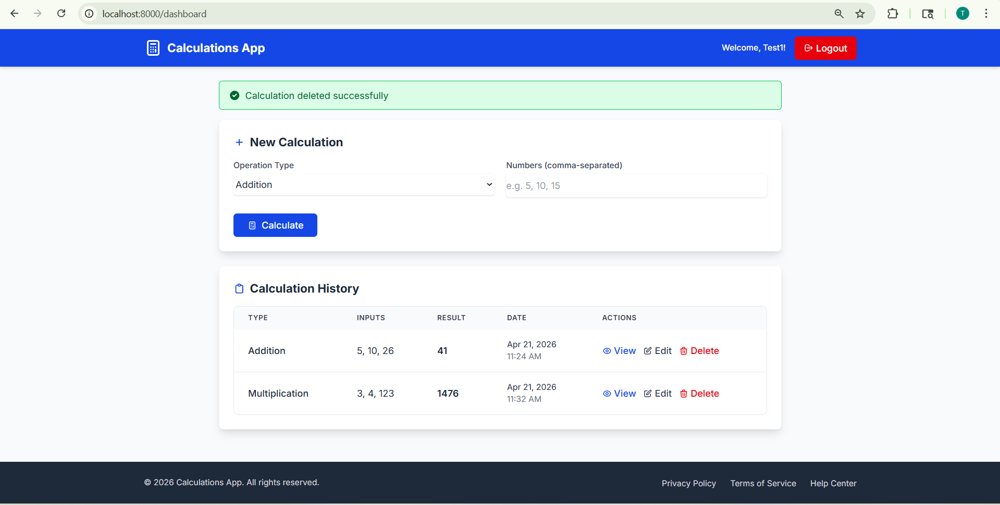
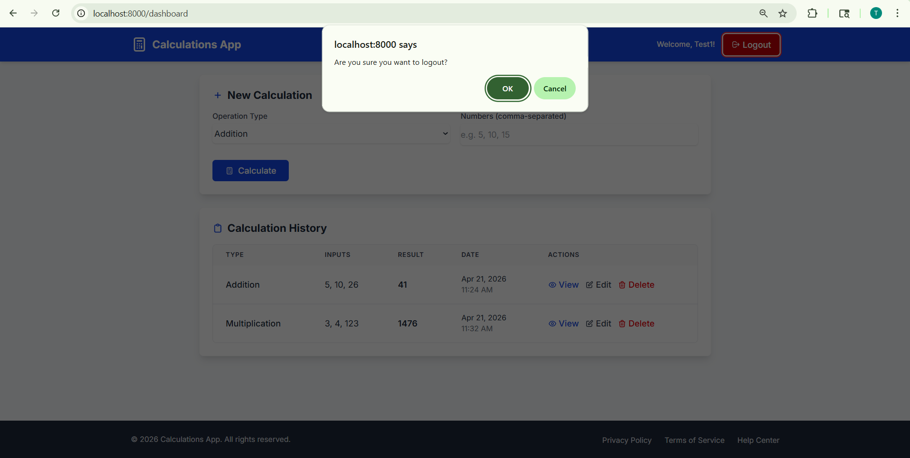
* Test results
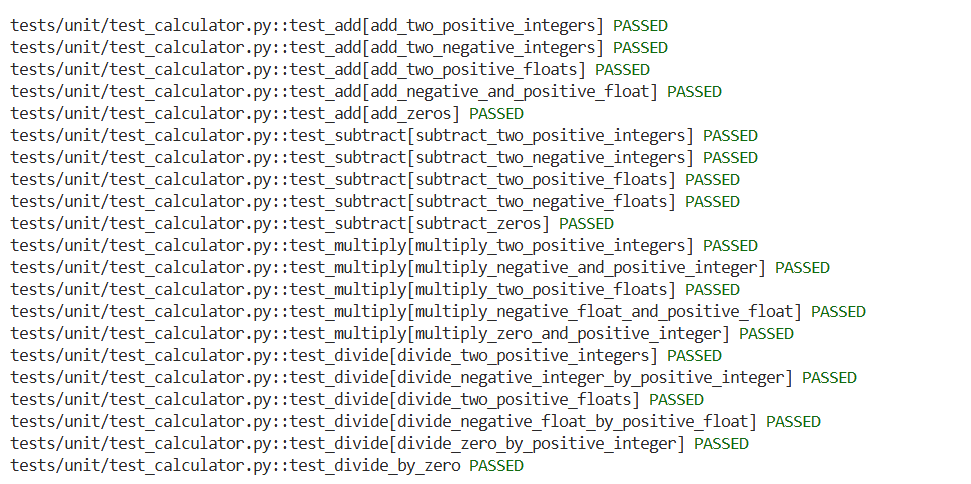
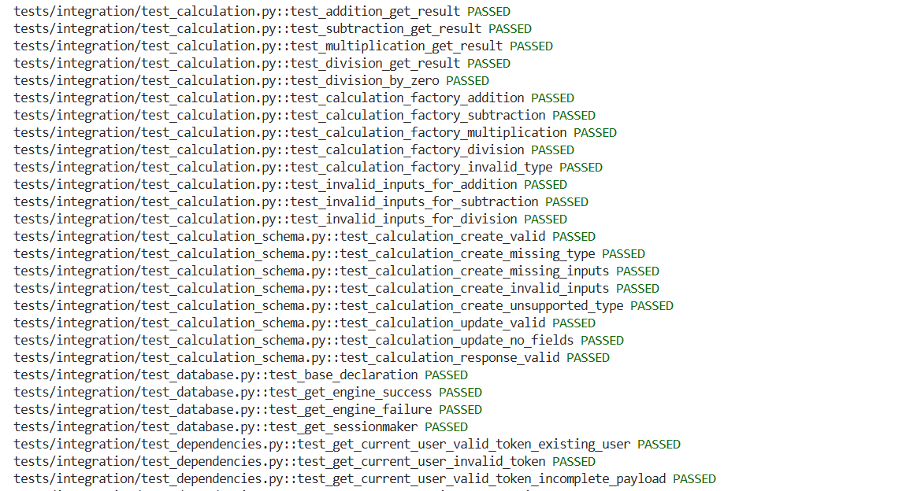
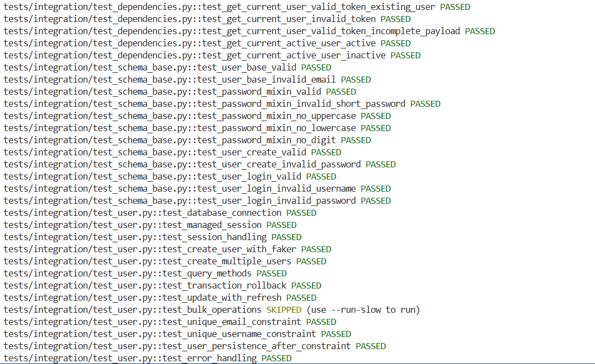
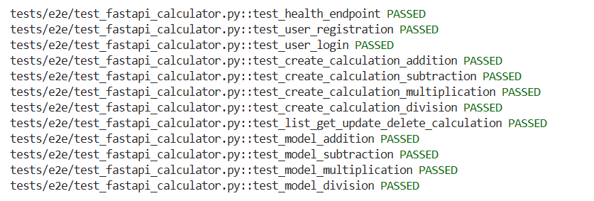
---
